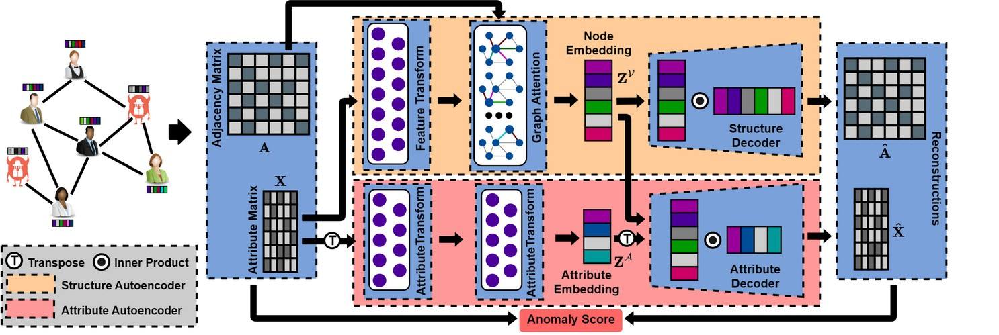
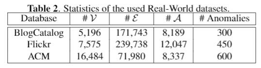

·

# AnomalyDAE

Implementation code of the algorithm described in paper "AnomalyDAE: Dual autoencoder for anomaly detection on attributed networks". 


<p align="center">
  
</p>


## Abstract 

Anomaly detection on attributed networks aims at finding nodes whose patterns deviate significantly from the majority of reference nodes, which is pervasive in many applications such as network intrusion detection and social spammer detection. However, most existing methods neglect the complex cross-modality interactions between network structure and node attribute. In this paper, we propose a novel deep joint representation learning framework for anomaly detection through a dual autoencoder (AnomalyDAE), which captures the complex interactions between network structure and node attribute for high-quality embeddings. Specifically, AnomalyDAE consists of a structure autoencoder and an attribute autoencoder to learn both node embedding and attribute embedding jointly in latent space. Moreover, attention mechanism is employed in structure encoder to learn the importance between a node and its neighbors for an effective capturing of structure pattern, which is important to anomaly detection. Besides, by taking both the node embedding and attribute embedding as inputs of attribute decoder, the cross-modality interactions between network structure and node attribute are learned during the reconstruction of node attribute. Finally, anomalies can be detected by measuring the reconstruction errors of nodes from both the structure and attribute perspective. Extensive experiments on real-world datasets demonstrate the effectiveness of the proposed method.


## Experimental results  


<p align="center">
  
</p>

<p align="center">
  
</p>

## Cite:

```
@inproceedings{fan2020anomalydae,
  title        = {AnomalyDAE: Dual autoencoder for anomaly detection on attributed networks},
  author       = {Haoyi Fan, Fengbin Zhang, and Zuoyong Li},
  booktitle    = {45th International Conference on Acoustics, Speech, and Signal Processing},
  year         = {2020},
  organization={IEEE}
}

```


